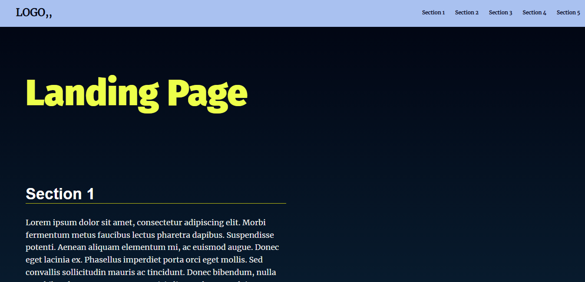

# Landing Page Project

## Table of Contents
* [Project Title](#landing-page-project)
* [Installation & Usage](#Installation-and-Usage)
* [Development](#Development)
* [Contribute](#Contribute)
* [License & Copyright](#License-&-Copyright)
* [Page Preview](#Page-Preview)
## Installation & Usage
[(Back to top)](#table-of-contents)

You can install this project to your PC by downloading it as a ZIP file. 
After downloading you can use the project files by unzip the file then open it on any code editor e.g.(VS Code).

---
## Development

[(Back to top)](#table-of-contents)

>
>**_JS Version: ES2015/ES6_**
>**_JS Standard: ESlint_**
>

#### Project Contains four files:
#### assets / css /
- style.css
#### assets / js / 
- app.js
#### index.html
#### README.md
#### **Each file contain it's modification and comment above each step of modify.**

---
## Contribute

[(Back to top)](#table-of-contents)

**- Udacity**

---
## License & Copyright

[(Back to top)](#table-of-contents)

---
## Page Preview

[(Back to top)](#table-of-contents)

